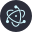

# Guildless



**会社の目標を、調査・判断・実行・証拠・入金まで閉じるAI企業運営OS。**

Guildlessは、モデル名やAgentの数を経営者に選ばせません。ユーザーは「この会社を伸ばして。まず月商を100万円増やして」のようなOutcomeを一つ入力します。Guildlessは会社を調べ、販売可能な資産と能力を確認し、市場・成功事例・失敗事例・競合を比較し、最短の現金化案を選び、許可された範囲で実行し、実入金を証拠付きで記録します。

## 言語 / Languages / 语言

- [日本語](README.ja.md)
- [English](README.en.md)
- [简体中文](README.zh-CN.md)

## 製品ループ

```text
Outcome
  ↓ 会社理解（事実 + 根拠）
Capability gap
  ↓ Local → GitHub → public-apis → npm/PyPI → Hugging Face → MCP → Browser/Web
Strategy options → Money Bet
  ↓ 承認された範囲で実行
Verified money / outcome
  ↓ 次の判断へ学習
```

経営画面には、今調べていること、分かったこと、現在の判断、次にすること、人間が必要なこと、確認済みの入金を表示します。モデル名・Agent名・tool call・内部ログは開発者向け診断に隔離します。

## 含まれるもの

- `guildless verify`：commit、コマンド、HTTP、検証範囲を機械的に確認する決定論的な完了ゲート
- `python/guildless_v0/core/`：証拠付きMoney Intelligence、Playbook、Money Bet
- `capability-acquisition/`：Local / GitHub / public-apis / package / HF / MCP / Browser候補の発見・検証・登録
- `docs/`：Executive Operating Viewと安全境界

`public-apis/public-apis` は候補カタログであり、掲載されたAPIを自動実行しません。公式仕様、稼働、認証、料金、商用利用、rate limit、実リクエストを検証してから登録します。

## 開発

```sh
npm install
npm run check
npm test
npm run build
npm run lint
python python/run_tests.py
node capability-acquisition/test_acquisition.js
```

## 安全境界

- 外部送信、契約、決済、公開、削除は承認前に実行しない
- Founder Memory Raw DBとHistorical Benchmark DBへ直接接続しない
- 事実と推論を分離し、事実には根拠を付ける
- 候補発見と採用を分離し、未検証のOSS/APIを実行しない
- 実入金だけを確認済み売上として数える

## ライセンス

MIT License。追加した外部由来コードは各LICENSE/NOTICEと取得コミットを記録します。
